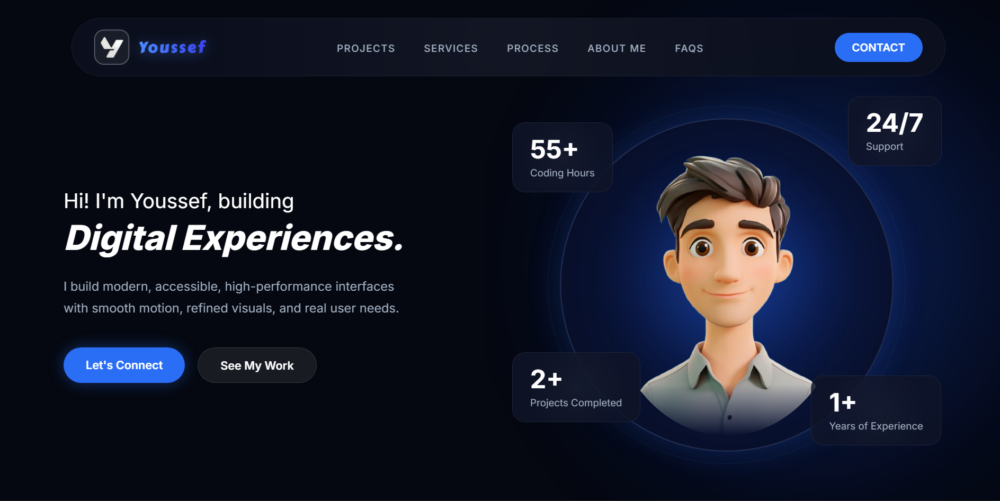

# Personal Portfolio

## Project Description

This project is a personal portfolio website designed to showcase my profile, skills, projects, and contact information.  
The goal is to create a professional online presence where I can present my work, achievements, and journey as a web developer.

## Main Features

- Homepage with a short introduction
- “About Me” section to introduce my profile
- Services section
- Projects section with descriptions and links
- Contact form or contact section
- Responsive design for desktop, tablet, and mobile devices
- Simple and intuitive navigation

## Technologies Used

- HTML5
- CSS3
- JavaScript
- Responsive Design
- Git / GitHub
- GitHub Pages for deployment

## Website Screenshot



## Figma Design

Link to the Figma design:  
[View the Figma Design](https://www.figma.com/design/fYVqZdtMXLnFcBp0OWL1Ke/Portfolio?node-id=0-1&t=SfvwBrbDgRQlkPN8-1)

## Live Version

Link to the live website:  
[View the Live Portfolio](https://your-username.github.io/repository-name/)

> Replace this link with the real link to your deployed website.

## Installation and Usage

1. Clone the repository:

```bash
git clone https://github.com/your-username/repository-name.git
